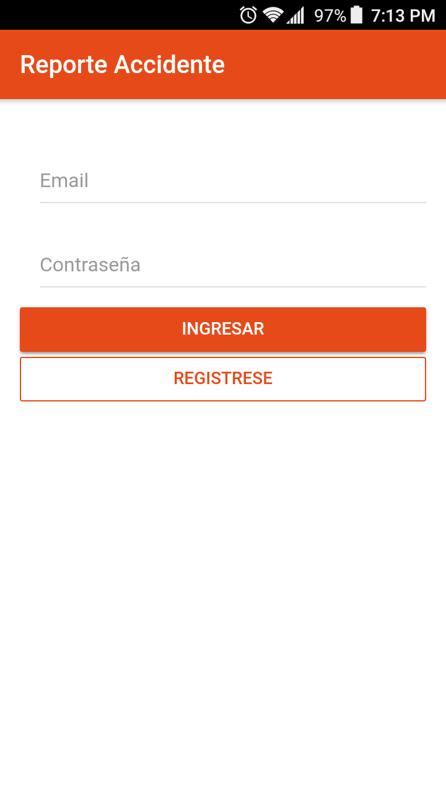
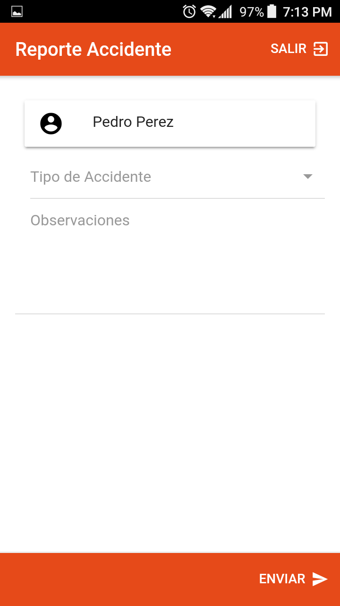
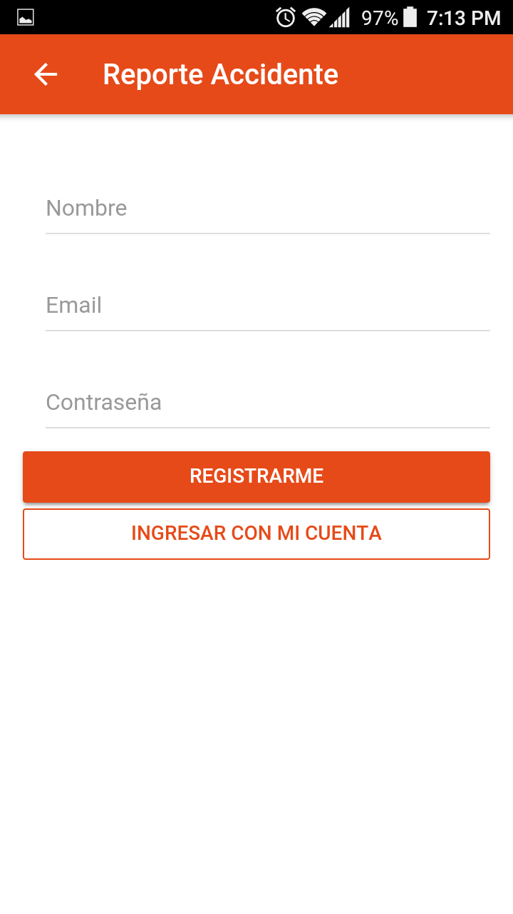
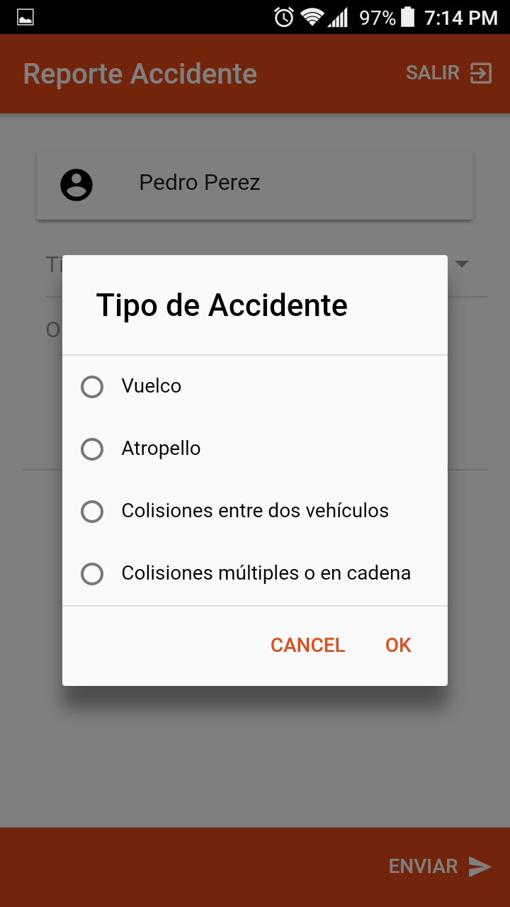

Reporte Accidente App
=====================

Descarga APK: [Enlace](https://drive.google.com/open?id=1WA7e0uyaQb-ijMehDALfbDlCHD8Whaji)

****************
Algunas capturas
****************

### Login

### Inicio

### Registro

### Tipo de accidente

************************************
Tecnologías y Herramientas empleadas
************************************

- [Ionic 4.0.1](https://ionicframework.com/)

- [Axios](https://github.com/axios/axios)

*************
Desarrollador
*************

Simon González @rockersgz
e-mail: gonzalezsimon18@gmail.com
